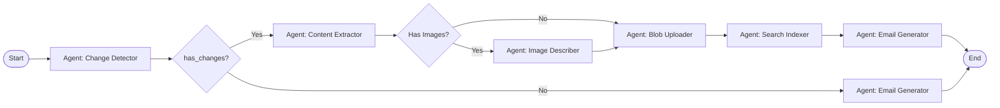

# Converting to Microsoft Foundry (Azure AI Foundry) Agents

## Overview

Your current Python pipeline can be converted into modular Foundry agents. Each agent becomes a reusable block in the Foundry workflow designer.

## Architecture Mapping

### Current Pipeline → Foundry Agents

```
Current Python Files              →  Foundry Agent Blocks
━━━━━━━━━━━━━━━━━━━━━━━━━━━━━━━━━━━━━━━━━━━━━━━━━━━━━━━━━

single_page_monitor.py           →  Agent: Change Detector
confluence_content_extractor.py  →  Agent: Content Extractor
image_description_generator.py   →  Agent: Image Describer
blob_storage_uploader.py         →  Agent: Blob Uploader
azure_search_indexer.py          →  Agent: Search Indexer
email_digest_generator.py        →  Agent: Email Generator
  ├─ agent_change_summarizer     →  Sub-agent: Change Summarizer
  ├─ agent_content_writer        →  Sub-agent: Content Writer
  └─ agent_html_formatter        →  Sub-agent: HTML Formatter
```

## Step-by-Step Conversion Guide

### Step 1: Create Agent Definitions

Each agent needs a JSON definition file:

#### agent_change_detector.json
```json
{
  "name": "ChangeDetectorAgent",
  "version": "1.0.0",
  "description": "Detects changes in Confluence pages using hash comparison",
  "type": "agent",
  "inputs": {
    "page_id": {
      "type": "string",
      "required": true,
      "description": "Confluence page ID"
    }
  },
  "outputs": {
    "has_changes": {
      "type": "boolean",
      "description": "Whether content has changed"
    },
    "version_number": {
      "type": "integer",
      "description": "New version number"
    },
    "change_summary": {
      "type": "string",
      "description": "Summary of changes detected"
    },
    "previous_version": {
      "type": "integer",
      "description": "Previous version number"
    }
  },
  "runtime": {
    "type": "python",
    "entry_point": "main.py",
    "requirements": [
      "azure-storage-blob>=12.0.0",
      "requests>=2.31.0"
    ]
  }
}
```

#### Agent Implementation (agent_change_detector/main.py)
```python
"""
Change Detector Agent for Foundry
Entry point that Foundry will call
"""

import os
import json
from typing import Dict, Any

def main(inputs: Dict[str, Any]) -> Dict[str, Any]:
    """
    Foundry agent entry point
    
    Args:
        inputs: Dict with keys: page_id
        
    Returns:
        Dict with keys: has_changes, version_number, change_summary, previous_version
    """
    from single_page_monitor import detect_changes_optimized
    
    page_id = inputs['page_id']
    
    # Call your existing function
    result = detect_changes_optimized(page_id)
    
    # Return in Foundry-compatible format
    return {
        "has_changes": result['has_changes'],
        "version_number": result['version_number'],
        "change_summary": result['change_summary'],
        "previous_version": result.get('previous_version')
    }

# Foundry expects this signature
if __name__ == "__main__":
    # Read inputs from stdin (Foundry passes them this way)
    inputs = json.loads(os.environ.get('AGENT_INPUTS', '{}'))
    outputs = main(inputs)
    print(json.dumps(outputs))
```

### Step 2: Create Agent Packages

Organize each agent as a package:

```
foundry_agents/
├── change_detector/
│   ├── agent.json
│   ├── main.py
│   ├── requirements.txt
│   └── README.md
│
├── content_extractor/
│   ├── agent.json
│   ├── main.py
│   ├── requirements.txt
│   └── README.md
│
├── image_describer/
│   ├── agent.json
│   ├── main.py
│   ├── requirements.txt
│   └── README.md
│
├── blob_uploader/
│   ├── agent.json
│   ├── main.py
│   ├── requirements.txt
│   └── README.md
│
├── search_indexer/
│   ├── agent.json
│   ├── main.py
│   ├── requirements.txt
│   └── README.md
│
└── email_generator/
    ├── agent.json
    ├── main.py
    ├── requirements.txt
    ├── sub_agents/
    │   ├── change_summarizer.py
    │   ├── content_writer.py
    │   └── html_formatter.py
    └── README.md
```

### Step 3: Deploy to Foundry

#### Using Azure CLI
```bash
# Login to Azure
az login

# Set subscription
az account set --subscription "your-subscription-id"

# Create AI Foundry project (if not exists)
az ml workspace create \
  --name "cip-weekly-digest" \
  --resource-group "your-rg" \
  --location "eastus"

# Register each agent
cd foundry_agents/change_detector
az ml component create --file agent.json
```

#### Using Foundry UI
1. Go to https://ai.azure.com
2. Select your project: "kirk_mcpherson-demorag"
3. Navigate to **Agents** → **Create Agent**
4. Upload your agent package (zip file)
5. Configure inputs/outputs
6. Test the agent
7. Publish

### Step 4: Create Workflow in Foundry UI

Now build your workflow visually:



### Step 5: Example Agent Template

Here's a complete template for the Content Extractor agent:

#### foundry_agents/content_extractor/agent.json
```json
{
  "name": "ContentExtractorAgent",
  "version": "1.0.0",
  "description": "Extracts content from Confluence pages including text, images, tables",
  "type": "agent",
  "inputs": {
    "page_id": {
      "type": "string",
      "required": true
    },
    "confluence_api_key": {
      "type": "string",
      "required": true,
      "secret": true
    }
  },
  "outputs": {
    "document": {
      "type": "object",
      "description": "Extracted document with content blocks"
    },
    "images_count": {
      "type": "integer"
    },
    "success": {
      "type": "boolean"
    }
  },
  "runtime": {
    "type": "python",
    "version": "3.11",
    "entry_point": "main.py",
    "requirements": [
      "requests>=2.31.0",
      "beautifulsoup4>=4.12.0"
    ],
    "environment": {
      "CONFLUENCE_BASE_URL": "${env:CONFLUENCE_BASE_URL}"
    }
  },
  "compute": {
    "instance_type": "Standard_D2s_v3",
    "timeout_minutes": 5
  }
}
```

#### foundry_agents/content_extractor/main.py
```python
"""
Content Extractor Agent for Foundry
"""

import json
import os
import sys
from typing import Dict, Any

def main(inputs: Dict[str, Any]) -> Dict[str, Any]:
    """
    Extract content from Confluence page
    
    Args:
        inputs: {
            "page_id": str,
            "confluence_api_key": str (from secrets)
        }
        
    Returns:
        {
            "document": dict,
            "images_count": int,
            "success": bool
        }
    """
    # Import your existing function
    from confluence_content_extractor import extract_and_save_page
    
    page_id = inputs['page_id']
    
    # Set environment variable for API key
    os.environ['CONFLUENCE_API_KEY'] = inputs.get('confluence_api_key', '')
    
    try:
        # Call your existing function
        document = extract_and_save_page(page_id)
        
        if document:
            images_count = sum(1 for block in document.get('content_blocks', []) 
                             if block.get('type') == 'image')
            
            return {
                "document": document,
                "images_count": images_count,
                "success": True
            }
        else:
            return {
                "document": None,
                "images_count": 0,
                "success": False
            }
    
    except Exception as e:
        print(f"Error: {e}", file=sys.stderr)
        return {
            "document": None,
            "images_count": 0,
            "success": False,
            "error": str(e)
        }

# Foundry entry point
if __name__ == "__main__":
    # Read inputs from environment
    inputs_json = os.environ.get('FOUNDRY_AGENT_INPUTS', '{}')
    inputs = json.loads(inputs_json)
    
    # Execute agent
    outputs = main(inputs)
    
    # Write outputs
    print(json.dumps(outputs))
```

### Step 6: Shared Libraries

Create a shared library for common code:

```
foundry_agents/
└── shared/
    ├── __init__.py
    ├── azure_clients.py      # Blob, Search clients
    ├── confluence_api.py     # Confluence API wrapper
    └── utils.py              # Common utilities
```

Each agent's requirements.txt includes:
```
../shared/
```

### Step 7: Testing Locally

Test agents locally before deploying:

```python
# test_agent_local.py
import json
from foundry_agents.content_extractor.main import main

# Test inputs
inputs = {
    "page_id": "164168599",
    "confluence_api_key": "your-key"
}

# Run agent
outputs = main(inputs)

print(json.dumps(outputs, indent=2))
```

### Step 8: Deployment Script

```bash
#!/bin/bash
# deploy_agents.sh

AGENTS=(
    "change_detector"
    "content_extractor"
    "image_describer"
    "blob_uploader"
    "search_indexer"
    "email_generator"
)

for agent in "${AGENTS[@]}"; do
    echo "Deploying $agent..."
    cd "foundry_agents/$agent"
    
    # Create zip package
    zip -r "../${agent}.zip" .
    
    # Upload to Foundry
    az ml component create \
        --file agent.json \
        --workspace-name "cip-weekly-digest" \
        --resource-group "your-rg"
    
    cd ../..
done

echo "All agents deployed!"
```

## Benefits of Foundry Agents

1. **Visual Workflow**: Build pipelines in UI, no code
2. **Reusability**: Use agents across multiple workflows
3. **Monitoring**: Built-in logging and metrics
4. **Versioning**: Track agent versions
5. **Scalability**: Auto-scaling based on load
6. **Collaboration**: Team can work on different agents
7. **Testing**: Test individual agents in isolation

## Next Steps

1. **Start with one agent**: Convert `email_digest_generator.py` first
2. **Test locally**: Ensure it works with Foundry input/output format
3. **Deploy to Foundry**: Upload and test in UI
4. **Build workflow**: Connect agents visually
5. **Iterate**: Convert remaining agents one by one

## Resources

- [Azure AI Foundry Docs](https://learn.microsoft.com/en-us/azure/ai-studio/)
- [Agent Framework SDK](https://github.com/microsoft/agent-framework)
- [Foundry Agent Samples](https://github.com/Azure/azure-ai-samples)

Would you like me to help convert a specific agent first?
