# CIP Weekly Digest - Mermaid Diagrams

Copy these diagrams to any Mermaid-compatible viewer (GitHub, Notion, Confluence, etc.)

---

## 1. Overall System Architecture

```mermaid
flowchart LR
    subgraph Input["📥 Input"]
        CONF[("Confluence")]
    end
    
    subgraph Triggers["⚡ Triggers"]
        TIMER[/"Timer"/]
        HTTP[/"HTTP"/]
    end
    
    subgraph Pipeline["🔧 Processing Pipeline"]
        direction TB
        DETECT["Change Detector"]
        EXTRACT["Content Extractor"]
        IMAGE["Image Processor"]
        INDEX["Search Indexer"]
        EMAILGEN["Email Generator"]
    end
    
    subgraph AI["🤖 AI"]
        GPT["GPT-4o"]
        EMB["Embeddings"]
    end
    
    subgraph Storage["💾 Storage"]
        BLOB[("Blob")]
        SEARCH[("AI Search")]
        COSMOS[("Cosmos DB")]
    end
    
    subgraph Output["📤 Output"]
        LOGIC["Logic App"]
        O365[("Office 365")]
    end
    
    subgraph UI["🖥️ UI"]
        STREAM["Streamlit"]
    end

    %% Main Flow
    TIMER & HTTP --> DETECT
    CONF --> DETECT
    DETECT --> EXTRACT
    EXTRACT --> IMAGE
    IMAGE --> INDEX
    INDEX --> EMAILGEN
    
    %% AI Connections
    IMAGE --> GPT
    INDEX --> EMB
    EMAILGEN --> GPT
    
    %% Storage Connections
    DETECT --> BLOB
    INDEX --> SEARCH
    EMAILGEN --> COSMOS
    
    %% Output Flow
    EMAILGEN --> LOGIC
    LOGIC --> O365
    
    %% UI Flow
    STREAM --> COSMOS
    
    classDef input fill:#ffb8b8,stroke:#d98b8b,color:#7c2d2d
    classDef trigger fill:#a8d5ff,stroke:#5ba3d9,color:#1a365d
    classDef pipeline fill:#a8d5ff,stroke:#5ba3d9,color:#1a365d
    classDef ai fill:#b8e6b8,stroke:#7bc47b,color:#1e4620
    classDef storage fill:#ffe8b8,stroke:#d9b86b,color:#5c4813
    classDef output fill:#ffb8b8,stroke:#d98b8b,color:#7c2d2d
    classDef ui fill:#d4b8ff,stroke:#a67bd9,color:#3b1a5c
    
    class CONF input
    class TIMER,HTTP trigger
    class DETECT,EXTRACT,IMAGE,INDEX,EMAILGEN pipeline
    class GPT,EMB ai
    class BLOB,SEARCH,COSMOS storage
    class LOGIC,O365 output
    class STREAM ui
```

---

## 2. Complete Pipeline Flow (Sequence)

---

## 3. Change Detection Flow

---

## 4. Email Generation Flow

---

## 5. Subscription Management Flow

---

## 6. Data Storage Architecture

---

## 7. Technology Stack

---

## 8. Component Interaction

---

## 9. Deployment Architecture

---

## Color Legend

| Color | Hex | Usage |
|-------|-----|-------|
| 🔵 Soft Blue | `#a8d5ff` | Azure Functions / Core Processing |
| 🔴 Soft Red | `#ffb8b8` | External Systems (Confluence, O365) |
| 🟢 Soft Green | `#b8e6b8` | AI Services (GPT-4o, Embeddings) |
| 🟠 Soft Orange | `#ffe8b8` | Storage (Blob, Cosmos, Search) |
| 🟣 Soft Purple | `#d4b8ff` | Frontend (Streamlit) |
| ⚪ Light Gray | `#e8f0fe` | Neutral / Start nodes |

---

*Use these diagrams in GitHub README, Confluence, Notion, or any Mermaid-compatible viewer.*
