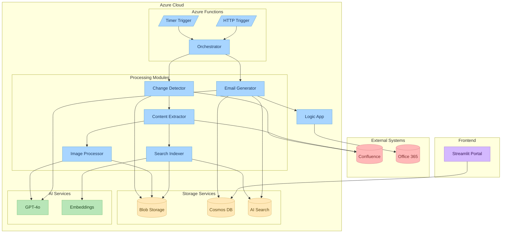
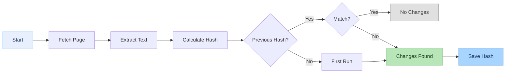
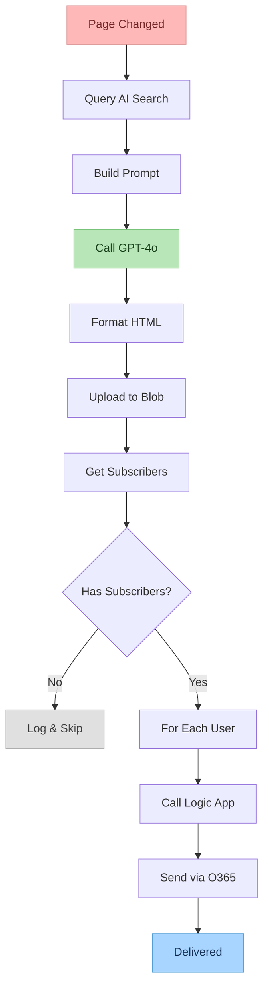
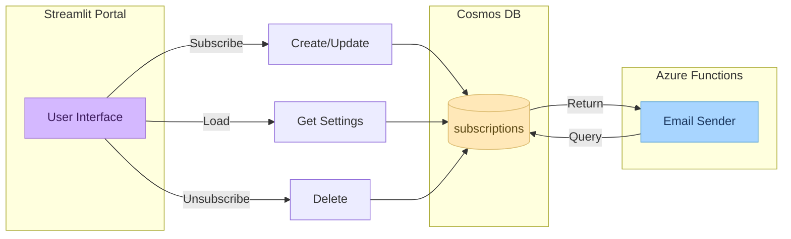
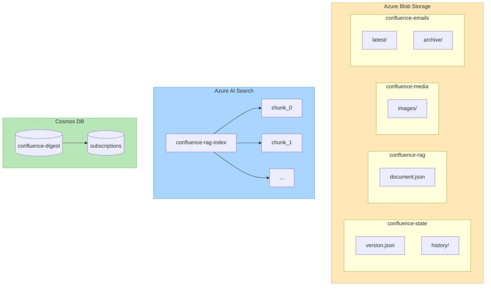

# CIP Weekly Digest - Complete Project Documentation

## Table of Contents
1. [Executive Summary](#executive-summary)
2. [High-Level Architecture](#high-level-architecture)
3. [System Components](#system-components)
4. [Data Flow](#data-flow)
5. [Module Documentation](#module-documentation)
6. [Azure Services Used](#azure-services-used)
7. [Deployment Guide](#deployment-guide)
8. [Configuration Reference](#configuration-reference)
9. [API Endpoints](#api-endpoints)
10. [Mermaid Diagrams](#mermaid-diagrams)

---

## Executive Summary

**CIP Weekly Digest** is an automated Confluence page monitoring system that:
- 🔍 **Monitors** specific Confluence pages for changes
- 🤖 **Generates** AI-powered email summaries using GPT-4o
- 📧 **Notifies** subscribers when pages are updated
- 🔎 **Indexes** content for semantic search using Azure AI Search
- 📊 **Manages** subscriptions via a Streamlit web portal

### Key Technologies
| Category | Technology |
|----------|------------|
| Backend | Azure Functions (Python 3.11) |
| AI/ML | Azure OpenAI GPT-4o, text-embedding-3-small |
| Database | Azure Cosmos DB (Serverless) |
| Search | Azure AI Search (Vector + Full-text) |
| Storage | Azure Blob Storage |
| Email | Azure Logic Apps + Office 365 |
| Frontend | Streamlit Cloud |
| Source Control | GitHub |

---

## High-Level Architecture

```
┌─────────────────────────────────────────────────────────────────────────────┐
│                         CIP WEEKLY DIGEST SYSTEM                            │
├─────────────────────────────────────────────────────────────────────────────┤
│                                                                             │
│  ┌──────────────┐    ┌─────────────────┐    ┌──────────────────────────┐   │
│  │  Confluence  │───▶│  Azure Functions │───▶│  Azure Blob Storage      │   │
│  │  (Source)    │    │  (Timer Trigger) │    │  - confluence-state      │   │
│  └──────────────┘    │                  │    │  - confluence-rag        │   │
│                      │  ┌────────────┐  │    │  - confluence-media      │   │
│                      │  │ Change     │  │    │  - confluence-emails     │   │
│                      │  │ Detection  │  │    └──────────────────────────┘   │
│                      │  └─────┬──────┘  │                │                  │
│                      │        │         │                │                  │
│                      │        ▼         │                ▼                  │
│                      │  ┌────────────┐  │    ┌──────────────────────────┐   │
│                      │  │ Content    │  │    │  Azure AI Search         │   │
│                      │  │ Extraction │  │    │  (Vector Index)          │   │
│                      │  └─────┬──────┘  │    └──────────────────────────┘   │
│                      │        │         │                                   │
│                      │        ▼         │                                   │
│                      │  ┌────────────┐  │    ┌──────────────────────────┐   │
│                      │  │ GPT-4o     │  │    │  Azure Cosmos DB         │   │
│                      │  │ Summary    │──┼───▶│  (Subscriptions)         │   │
│                      │  └─────┬──────┘  │    └──────────────────────────┘   │
│                      │        │         │                │                  │
│                      │        ▼         │                │                  │
│                      │  ┌────────────┐  │                │                  │
│                      │  │ Email      │  │                │                  │
│                      │  │ Generator  │  │                │                  │
│                      │  └─────┬──────┘  │                │                  │
│                      └────────┼─────────┘                │                  │
│                               │                          │                  │
│                               ▼                          ▼                  │
│                      ┌─────────────────┐    ┌──────────────────────────┐   │
│                      │  Azure Logic App│    │  Streamlit Portal        │   │
│                      │  (Email Sender) │    │  (Subscription UI)       │   │
│                      └────────┬────────┘    └──────────────────────────┘   │
│                               │                                             │
│                               ▼                                             │
│                      ┌─────────────────┐                                   │
│                      │  Office 365     │                                   │
│                      │  (Email Inbox)  │                                   │
│                      └─────────────────┘                                   │
│                                                                             │
└─────────────────────────────────────────────────────────────────────────────┘
```

---

## System Components

### 1. Azure Functions (Backend Processing)

| Function | Trigger | Purpose |
|----------|---------|---------|
| `pipeline_orchestrator` | Timer (every 5 min) | Main orchestrator - runs the complete pipeline |
| `run_pipeline` | HTTP | Manual trigger with `force_email=true` parameter |

### 2. Core Python Modules

| Module | File | Purpose |
|--------|------|---------|
| Change Detector | `single_page_monitor.py` | Detects content changes via hash comparison |
| Content Extractor | `confluence_content_extractor.py` | Extracts text/images from Confluence API |
| Image Processor | `image_description_generator.py` | Generates AI descriptions for images |
| Blob Uploader | `blob_storage_uploader.py` | Uploads content to Azure Blob Storage |
| Search Indexer | `azure_search_indexer.py` | Creates vector embeddings & indexes content |
| Email Generator | `email_digest_generator.py` | Generates HTML emails using GPT-4o |
| Email Sender | `email_sender.py` | Sends emails via Logic App |
| Subscription Manager | `subscription_manager.py` | Manages user subscriptions in Cosmos DB |

### 3. Streamlit Portal (Frontend)

| Component | File | Purpose |
|-----------|------|---------|
| Subscription App | `streamlit_portal/app.py` | User interface for managing subscriptions |

---

## Data Flow

### Complete Pipeline Flow

```
1. TRIGGER (Timer/HTTP)
       │
       ▼
2. CHANGE DETECTION
   ├── Fetch page from Confluence API
   ├── Extract raw text content
   ├── Calculate SHA-256 hash
   ├── Compare with stored hash
   └── Return: has_changes, version, title
       │
       ▼ (if changes detected)
3. CONTENT EXTRACTION
   ├── Parse Confluence storage format HTML
   ├── Extract content blocks (text, headings, tables, images)
   ├── Download images from Confluence
   └── Save document.json locally
       │
       ▼
4. IMAGE PROCESSING
   ├── Load document.json
   ├── For each image: call GPT-4o Vision API
   ├── Generate alt-text descriptions
   └── Update document with descriptions
       │
       ▼
5. BLOB UPLOAD
   ├── Upload document.json to confluence-rag container
   ├── Upload images to confluence-media container
   └── Save state to confluence-state container
       │
       ▼
6. SEARCH INDEXING
   ├── Chunk document into segments
   ├── Generate embeddings (text-embedding-3-small)
   ├── Delete old chunks for this page
   └── Upload chunks to Azure AI Search
       │
       ▼
7. EMAIL GENERATION
   ├── Query search index for context
   ├── Build prompt with changes & content
   ├── Call GPT-4o to generate summary
   └── Format as professional HTML email
       │
       ▼
8. EMAIL DELIVERY
   ├── Query Cosmos DB for subscribers
   ├── For each subscriber:
   │   ├── Call Logic App HTTP endpoint
   │   └── Logic App sends via Office 365
   └── Log delivery results
```

---

## Module Documentation

### 1. single_page_monitor.py

**Purpose**: Detects changes in Confluence pages using content hash comparison.

**Key Functions**:
```python
def extract_raw_text(page_id) -> dict:
    """
    Extract raw text from Confluence page.
    Returns: {
        'raw_text': str,
        'content_hash': str (SHA-256),
        'extracted_at': str (ISO timestamp),
        'page_id': str,
        'confluence_version': int,
        'title': str
    }
    """

def detect_changes_optimized(page_id) -> dict:
    """
    Compare current content with stored version.
    Returns: {
        'has_changes': bool,
        'needs_reprocessing': bool,
        'version_number': int,
        'change_summary': str,
        'title': str
    }
    """
```

**Storage**: Uses `confluence-state` blob container to store version hashes.

---

### 2. confluence_content_extractor.py

**Purpose**: Extracts structured content from Confluence pages while preserving order.

**Key Features**:
- Parses Confluence storage format HTML
- Extracts text, headings, tables, lists in sequence
- Downloads attached images
- Handles external image URLs

**Output Structure** (`document.json`):
```json
{
  "page_id": "164168599",
  "title": "ProPM Roles & Responsibilities",
  "space_key": "CIPPMOPF",
  "version": 15,
  "url": "https://eaton-corp.atlassian.net/wiki/spaces/CIPPMOPF/pages/164168599",
  "extracted_at": "2026-01-28T15:30:00Z",
  "content_blocks": [
    {"type": "heading", "level": 1, "content": "Overview", "index": 0},
    {"type": "text", "content": "Project management roles...", "index": 1},
    {"type": "image", "filename": "diagram.png", "url": "...", "index": 2}
  ]
}
```

---

### 3. image_description_generator.py

**Purpose**: Generates AI descriptions for images using GPT-4o Vision.

**Key Function**:
```python
def describe_images_in_document(doc_path: str) -> bool:
    """
    Process all images in a document.json file.
    Updates each image block with 'description' field.
    Returns: True if successful
    """
```

**Example Output**:
```json
{
  "type": "image",
  "filename": "architecture.png",
  "description": "System architecture diagram showing data flow between Azure Functions, Blob Storage, and Cosmos DB with connecting arrows."
}
```

---

### 4. blob_storage_uploader.py

**Purpose**: Uploads processed content to Azure Blob Storage.

**Containers**:
| Container | Content |
|-----------|---------|
| `confluence-media` | Images and attachments |
| `confluence-rag` | RAG-ready JSON documents |
| `confluence-state` | Change detection state files |
| `confluence-emails` | Generated email HTML |

**Key Function**:
```python
def upload_page_to_blob(doc_folder: str) -> dict:
    """
    Upload document and media to blob storage.
    Returns: {'success': bool, 'uploaded_files': list}
    """
```

---

### 5. azure_search_indexer.py

**Purpose**: Creates and maintains the vector search index.

**Index Schema**:
| Field | Type | Purpose |
|-------|------|---------|
| `chunk_id` | String (Key) | Unique chunk identifier |
| `page_id` | String | Confluence page ID |
| `page_title` | String | Page title |
| `content_text` | String | Chunk text content |
| `content_vector` | Vector[1536] | text-embedding-3-small embedding |
| `has_image` | Boolean | Contains image? |
| `image_description` | String | AI image description |

**Key Functions**:
```python
def create_search_index() -> bool:
    """Create/update the search index schema."""

def index_single_page(page_id, space_key, delete_existing=True) -> int:
    """Index a single page, returns chunk count."""

def delete_page_chunks(page_id) -> int:
    """Delete all chunks for a page (before re-indexing)."""
```

---

### 6. email_digest_generator.py

**Purpose**: Generates professional HTML email summaries using GPT-4o.

**Key Functions**:
```python
def generate_page_summary_email(page_id, space_key, version, change_summary, page_title) -> dict:
    """
    Generate email digest for a page update.
    Returns: {
        'success': bool,
        'html_content': str,
        'email_subject': str,
        'summary': str
    }
    """

def format_email_html(page_title, summary, version, changes, page_url) -> str:
    """Format summary into professional HTML email template."""
```

**Email Template Features**:
- Professional teal/green color scheme (#00796b)
- Executive summary box
- Key changes section
- Version badge
- Mobile-responsive
- Email client compatible (solid colors, no CSS gradients)

---

### 7. email_sender.py

**Purpose**: Sends emails via Azure Logic App with retry logic.

**Key Functions**:
```python
def send_email_via_logic_app(to_email, subject, html_body, max_retries=3) -> dict:
    """
    Send email with exponential backoff retry.
    Returns: {'status': 'success'|'error', 'message': str}
    """

def notify_subscribers_for_page(page_id, page_title, html_content, version) -> dict:
    """
    Send email to all subscribers of a page.
    Returns: {'sent_count': int, 'failed_count': int}
    """
```

---

### 8. subscription_manager.py

**Purpose**: Manages user subscriptions in Azure Cosmos DB.

**Data Model**:
```json
{
  "id": "john_at_eaton_com",
  "partitionKey": "subscriptions",
  "email": "john@eaton.com",
  "displayName": "John Doe",
  "subscriptions": [
    {
      "pageId": "164168599",
      "pageName": "ProPM Roles & Responsibilities",
      "subscribedAt": "2026-01-28T15:00:00Z"
    }
  ],
  "preferences": {
    "frequency": "immediate",
    "digestFormat": "html"
  },
  "createdAt": "2026-01-28T15:00:00Z",
  "updatedAt": "2026-01-28T15:00:00Z"
}
```

**Key Functions**:
```python
def get_subscription(email) -> dict
def create_or_update_subscription(email, display_name, page_ids) -> dict
def get_subscribers_for_page(page_id) -> list
def unsubscribe_all(email) -> bool
```

---

### 9. Streamlit Portal (streamlit_portal/app.py)

**Purpose**: Web UI for subscription management.

**Features**:
- ✅ Subscribe to pages
- ✅ Update existing subscriptions
- ✅ View subscription details
- ✅ Unsubscribe from all pages
- ✅ Mobile-responsive design

**Deployment**: Streamlit Cloud (https://cip-digest.streamlit.app)

---

## Azure Services Used

| Service | Resource Name | Purpose |
|---------|---------------|---------|
| **Azure Functions** | cip-digest-functions | Backend processing |
| **Azure Cosmos DB** | cip-digest-cosmos | Subscription storage |
| **Azure Blob Storage** | cipdigest | Content storage |
| **Azure AI Search** | cip-digest | Vector search |
| **Azure OpenAI** | llm-try-summariser | GPT-4o, embeddings |
| **Azure Logic Apps** | cip-digest-email-sender | Email delivery |
| **Office 365** | - | Email sending |

---

## Deployment Guide

### Azure Functions Deployment

```bash
# Navigate to Azure Functions folder
cd "Azure Functions"

# Login to Azure
az login

# Deploy
func azure functionapp publish cip-digest-functions
```

### Streamlit Cloud Deployment

1. Push `streamlit_portal/` to GitHub
2. Connect repo to Streamlit Cloud
3. Set main file path: `streamlit_portal/app.py`
4. Configure secrets in Streamlit Cloud dashboard

---

## Configuration Reference

### Environment Variables (local.settings.json)

```json
{
  "Values": {
    // Confluence API
    "CONFLUENCE_URL": "https://company.atlassian.net/wiki",
    "CONFLUENCE_EMAIL": "user@company.com",
    "CONFLUENCE_API_TOKEN": "...",
    
    // Azure OpenAI
    "AZURE_OPENAI_ENDPOINT": "https://....openai.azure.com/",
    "AZURE_OPENAI_API_KEY": "...",
    "AZURE_OPENAI_DEPLOYMENT_NAME": "gpt-4o",
    
    // Embeddings
    "FOUNDRY_EMBEDDING_ENDPOINT": "https://....cognitiveservices.azure.com",
    "FOUNDRY_EMBEDDING_API_KEY": "...",
    
    // Azure Search
    "AZURE_SEARCH_ENDPOINT": "https://....search.windows.net",
    "AZURE_SEARCH_API_KEY": "...",
    
    // Blob Storage
    "BLOB_STORAGE_CONNECTION_STRING": "...",
    "AZURE_STORAGE_ACCOUNT_NAME": "...",
    "AZURE_STORAGE_ACCOUNT_KEY": "...",
    
    // Cosmos DB
    "COSMOS_ENDPOINT": "https://....documents.azure.com:443/",
    "COSMOS_KEY": "...",
    
    // Logic App
    "LOGIC_APP_EMAIL_URL": "https://....logic.azure.com/...",
    
    // Pages to monitor
    "PAGE_IDS": "164168599,166041865,17386855,439124075",
    "SPACE_KEY": "CIPPMOPF"
  }
}
```

### Streamlit Secrets (secrets.toml)

```toml
COSMOS_ENDPOINT = "https://....documents.azure.com:443/"
COSMOS_KEY = "..."
COSMOS_DATABASE = "confluence-digest"
COSMOS_CONTAINER = "subscriptions"
```

---

## API Endpoints

### Azure Function HTTP Endpoints

| Endpoint | Method | Purpose |
|----------|--------|---------|
| `/api/run_pipeline` | GET/POST | Manual pipeline trigger |
| `/api/run_pipeline?force_email=true` | GET | Force email even without changes |

### Logic App Endpoint

```json
POST https://prod-26.eastus2.logic.azure.com/.../invoke
Content-Type: application/json

{
  "to": "user@company.com",
  "subject": "📄 Confluence Update: Page Title",
  "body": "<html>...</html>"
}
```

---

## Mermaid Diagrams

### Overall System Architecture



### Change Detection Flow



### Email Generation Flow



### Subscription Management Flow



### Data Storage Architecture



---

## Monitored Pages

| Page ID | Title | Description |
|---------|-------|-------------|
| 164168599 | ProPM Roles & Responsibilities | Project Management roles documentation |
| 166041865 | Agile - Scrum Roles & Responsibilities | Scrum team roles for Agile projects |
| 17386855 | RACI | Responsible, Accountable, Consulted, Informed matrix |
| 439124075 | EMPower AI Research | AI research documentation |

---

## Version History

| Version | Date | Changes |
|---------|------|---------|
| 1.0 | 2026-01-28 | Initial release with full pipeline |
| 1.1 | 2026-01-28 | Added professional email template |
| 1.2 | 2026-01-28 | Fixed page title display in emails |
| 1.3 | 2026-01-28 | Added retry logic to email sender |
| 1.4 | 2026-01-29 | Streamlit portal structure aligned with Azure Functions |

---

## Contact & Support

- **Repository**: https://github.com/ShantanuBhute/CIP_weekly_digest
- **Streamlit Portal**: https://cip-digest.streamlit.app
- **Team**: CIP Team

---

